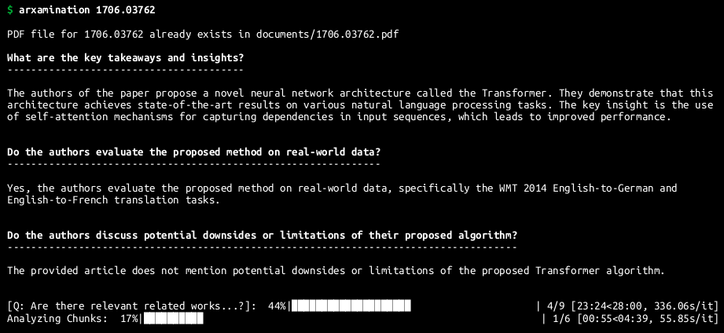

# prompt-arXamination

`prompt-arXamination` is a helpful tool powered by a Large Language Model (LLM) that streamlines the initial review of arXiv papers. It efficiently provides insights into key aspects of research papers, helping users quickly gauge their quality and relevance. Whether you're a researcher, student, or professional, this tool offers a convenient way to identify essential information in arXiv papers, saving you time and effort during the paper selection process. Make your research endeavors more manageable with prompt-arXamination.



## Installation

Clone the repository:

```shell
git clone https://github.com/rmattila/prompt-arXamination.git 
```

Navigate to the project directory:

```shell
cd prompt-arXamination 
```

Create a virtual environment (optional but recommended):

```shell
conda create -n arxamination-env
conda activate arxamination-env
```

Install the project's dependencies:

```shell
pip install -r requirements.txt
```

Next, install the arxamination package itself. This step is necessary for users who want to run the command-line tool:

```shell
pip install .
```

## Usage

Run the arxamination tool with the arXiv article ID as a command-line argument. For example:

```shell
arxamination 1706.03762
```

This command-line tool will fetch and analyze the specified arXiv article.

## What LLM is used? Do I need an API key?

This tool utilizes [GPT4All](https://gpt4all.io/index.html), which allows you to run LLMs locally, eliminating the need for costly API calls. You can specify a specific model in the `config.json`-file. 

The modular design makes it easy to extend the functionality to use other LLMs (e.g., OpenAI via API). By inheriting the `BaseLLM`-class and implementing the `get_LLM_response`-function, you can seamlessly integrate additional LLMs into the system to meet your specific needs.

## Ideas for Future Improvements

- Implement retrieval-augmented generation (RAG) to reduce the number of LLM queries
- Improve the prompt templates
- Enable users to process their own (local) PDF files -- i.e., not just arXiv papers 
- Integration with reference managers (e.g., [Zotero](https://www.zotero.org/) and [Mendeley](https://www.mendeley.com/)).
- Implement support for other LLMs (e.g., OpenAI via API)
- Generate reports in PDF and HTML formats for better documentation and sharing options